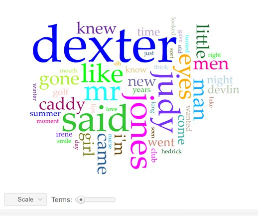
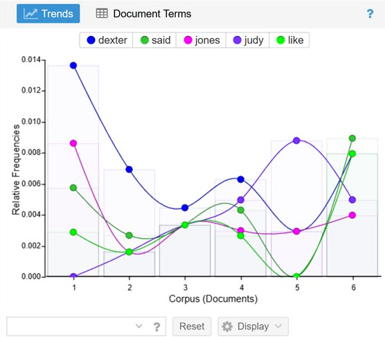
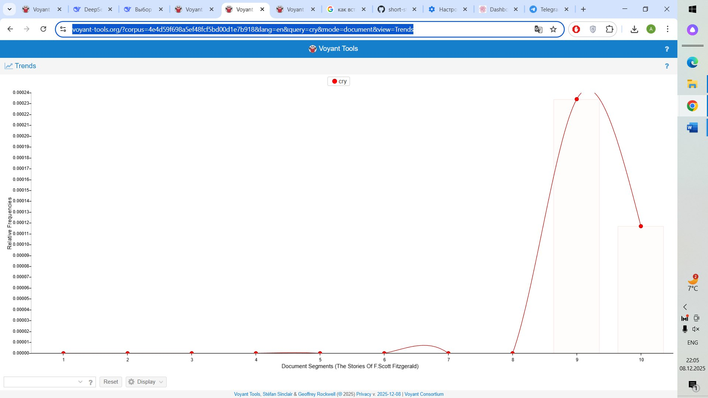

Fitzgerald's story "Winter Dreams" was written in 1922, a few years before the publication of his most famous novel "The Great Gatsby." Both works are built on the triad "American dream — social elevator — destructive love," where the figure of the unattainable "golden girl" from high society becomes for the hero, an upstart, simultaneously a motivation, a reward, and a verdict.

Let's turn to "Winter Dreams." The main characters: a girl from high society, Judy, and a simple guy in love with her, Dexter Green. The narration in the story is in the third person, and in the course of the narrative, the narrator changes the tone of speech from a detached observer to amazing psychological depth, literally merging with and transmitting the thoughts of the main character.

The narration, conducted in the third person with deep immersion in free indirect speech, allows us to trace the path of Dexter Green from the son of a grocery store owner to a successful businessman. His career is a classic story of a self-made man, but the hero's motivation is distorted from the very beginning: he strives for wealth not as an end in itself, but as a ticket to Judy Jones's world. Already in the first meeting on the golf course, where 14-year-old Dexter works as a caddy, and Judy appears as a spoiled client's daughter, the social chasm and psychological dependence that will define his life are laid. His success, thus, from the very beginning lacks intrinsic value and is merely a means to achieve an illusory goal.

The second meeting with Judy takes place in winter on a lake. Here we can talk about the symbolism of this moment. Winter is a time of cold and death, and yet winter is often associated with reveries. So Judy becomes a living embodiment of a detached, cold dream, almost destructive in its brilliance. Dexter idealizes Judy, he himself creates her as a "winter dream." Let's look at the epithets used for her: radiance, brilliance, and so on. Thus, Judy becomes not only a beloved but literally an embodiment of the idea of the "American dream," so alluring but unattainable. The peak of their romance fell in summer — a time of illusion, heat, and passion. However, one way or another, the "winter dream" was not destined to become reality — Judy chooses another, and Dexter learns several years later that over the years of marriage "the most beautiful of all women" became "ordinary" in the eyes of society. He cries for the first time — not from a broken heart, but from the realization that all his life and all his aspirations were merely a pursuit of illusory dreams, and that in fact he lost not Judy, but his ability to dream. The cyclical transition from winter to summer visualizes the inner drama of the main hero: his "American dream" turned out to be a seasonal phenomenon, unable to withstand the test of time.

Before uploading the full text of the story into Voyant, I tried to guess which words would be the most frequently used. Given the plot, my bet was on Dexter (because he is the main character), Judy, and also love and money, because these are key concepts and the story revolves around these two ideas. 

Then I loaded the corpus from the five parts of this story because the author himself divided this text into five parts of different sizes. We see that the name Judy appears only in the second part, when Dexter meets her as an adult and successful man on the lake, while at the moment of their first meeting, when the main character worked as an assistant at the golf club, she was just a nameless girl. Analysis by segments revealed an important detail: the name Judy is absent in segment I. In their first meeting at the golf club, she is merely a "girl," "her father." This emphasizes that initially Dexter fell in love not with a person, but with an anonymous symbol of wealth and beauty, which only later acquired a name.

Meanwhile, the graph of the usage of the words "winter" and "summer" goes in waves, showing the cyclical nature of the narrative and the dynamics of themes. The distribution of these words almost mirror-represents the arc of Dexter's own experiences — from the birth of a radiant dream to the culmination of a passionate summer romance and to winter disappointment. The story ends in winter, when in the cold season Dexter realizes the futility of all his dreams about an unattainable girl. 

The text ends with the lines "I cannot cry. I cannot care.", yet the verb "cry" was most frequently used precisely in the last two parts of the story. This quantitatively highlights the finale as an emotional resolution. The irony noted during close reading finds confirmation here: despite the final lines "I cannot cry. I cannot care", the verb "cry" itself becomes active precisely at the moment of highest tension, when the hero denies it.

Thus, quantitative analysis not only objectified the intuitions born from close reading but also allowed us to see the rhythm and accents of the story through the lens of data, supporting the thesis about "Winter Dreams" as a story of lost ability to dream. Thus, before us is not simply a drama of relationships, but a drama of realizing the dream itself as a kind of illusion.

